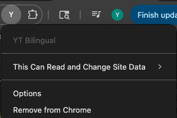

# Gu-Lingual: YouTube Bilingual Subtitles  
*A Chrome extension for real-time AI-powered captions.*  

---

## 🚀 Installation  

1. **Download & Load Extension**  
   - Clone or download this repository.  
   - If ZIP, unzip and open **Chrome** → go to `chrome://extensions/`.  
   - Enable **Developer mode** (top right).  
   - Click **Load unpacked** and select the project folder.  

2. **Configure API Key (Options Page)**  
   - Click the extension icon → **Options**. 
    

   - Enter your **OpenAI API key** if you want to use ChatGPT/LLM for high-quality translation. 
   - Press **save** to activate it.
   - ⚠️ Without an API key, the extension falls back to Google’s built-in translation.  
     Sentences may work but could sound less fluent.  

3. **Using Gu-Lingual on YouTube** 
   - Open any YouTube video with captions.  
   - Look for the **Gu-Lingual control panel** (bottom-right of the video player).  As shown:
   
   - You can:  
     - Toggle bilingual subtitles on/off.  
     - Choose translation source (**GPT** or **YouTube**).  
     - Select target language (English, Chinese, Japanese, Korean, etc.).  

---

## ✨ Features
- Real-time bilingual subtitles overlay.  
- AI-powered translation with LLM (ChatGPT).  
- Simple controls integrated into YouTube player.  