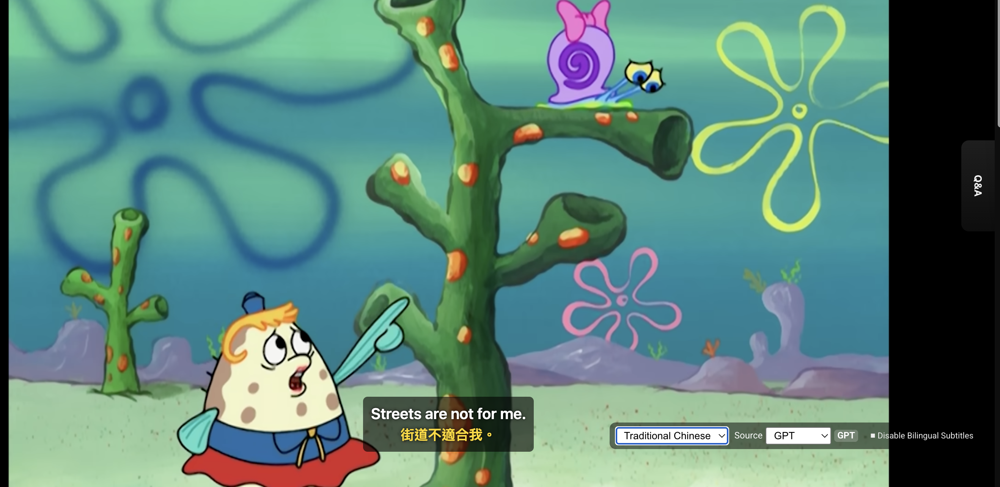
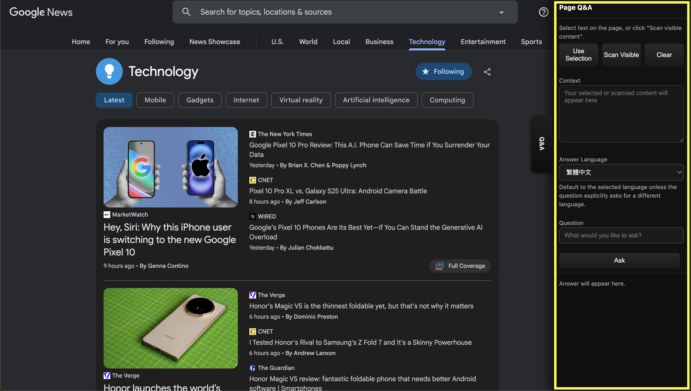
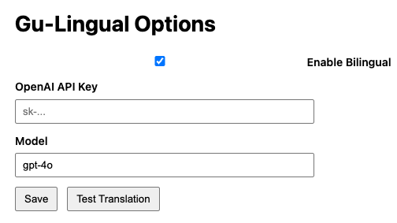

# Gu-Lingual: Chrome with AI Subtitles & Q&A
*A Chrome extension for real-time AI-powered captions & instant Q&A.*  

---
## 1. YouTube Bilingual Subtitles  
Do you want to explore and enjoy more channels on YouTube, even if they’re in different languages?

With Gu-Lingual, you can seamlessly watch content across languages with real-time bilingual subtitles.

---

## 2. Chrome Sidebar Q&A  

Do you ever want to quickly translate text or ask a question while browsing, without leaving the page you’re on?  
Gu-Lingual provides a **floating AI-powered sidebar panel** that stays with you while you surf Chrome.
 
 

With this panel, you can:  
- 🔎 **Instant Translation** — highlight or paste any text to translate it on the spot.  
- ❓ **Ask Questions** — type a question related to the page you’re reading (or any topic) and get an AI-generated answer immediately.  
- ⚡ **Stay in Context** — no need to switch tabs or disrupt your browsing flow, the panel slides in from the side whenever you need it.  
- 🎛 **Quick Controls** — open/close with a single click; the panel tucks away neatly when not in use.  

👉 *Vision: make Chrome not just a browser, but your smart AI assistant — always available, right by your side.*  

---
## ✨ Features
- Real-time bilingual subtitles overlay on YouTube.  
- AI-powered translation with LLM (ChatGPT).  
- Simple controls integrated into the YouTube player.  
- Chrome Sidebar Q&A (NEW): instantly translate or ask questions while browsing, without switching tabs.  

---

## 🚀 Installation  

1. **Download & Load Extension**  
   - Clone or download this repository.  
   - If ZIP, unzip and open **Chrome** → go to `chrome://extensions/`.  
   - Enable **Developer mode** (top right).  
   - Click **Load unpacked** and select the project folder.  

2. **Configure API Key (Options Page)**  
   - Click the extension icon → **Options**. 
    

   - Enter your **OpenAI API key** if you want to use ChatGPT/LLM for high-quality translation. 
   - Press **save** to activate it.
    
   - ⚠️ Without an API key, the extension falls back to Google’s built-in translation.  
     Sentences may work but could sound less fluent.  

3. **Using Gu-Lingual on YouTube** 
   - Open any YouTube video with captions.  
   - Look for the **Gu-Lingual control panel** (bottom-right of the video player).  As shown:
   
   - You can:  
     - Toggle bilingual subtitles on/off.  
     - Choose translation source (**GPT** or **YouTube**).  
     - Select target language (English, Chinese, Japanese, Korean, etc.).  